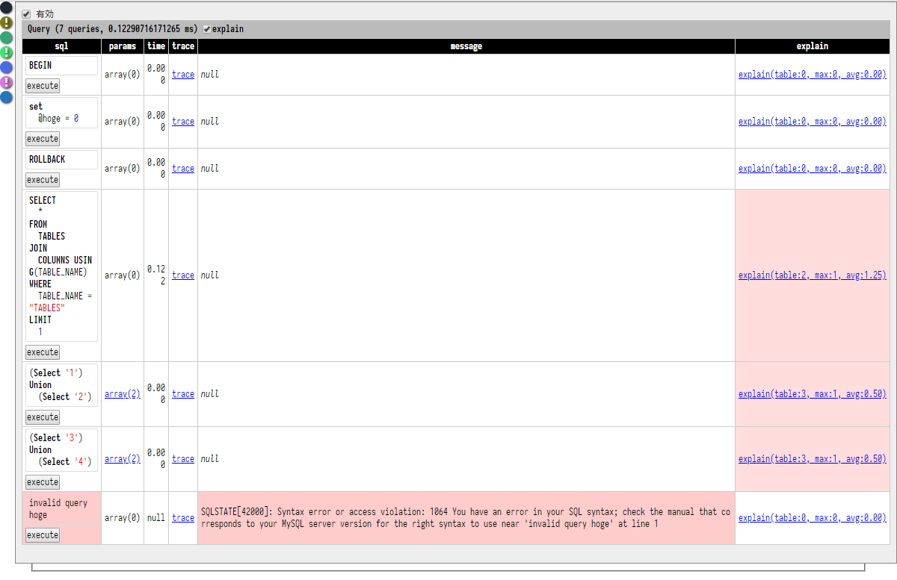
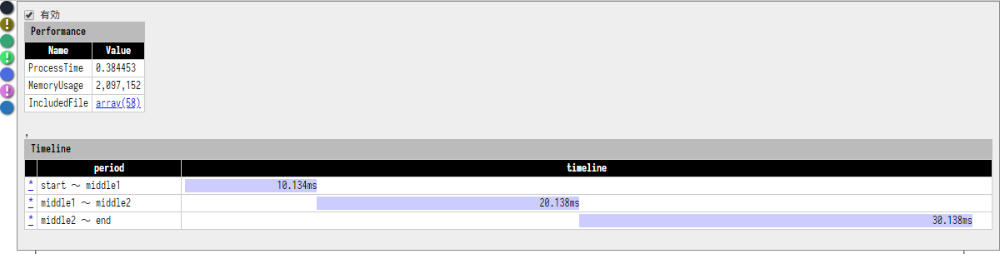

WebDebugger
====

## Description

フレームワークに依存せず、リクエスト中の各種情報を収集します。
要するに php-debugbar みたいなやつです。

主な機能は下記です。

- iframe で埋め込まれるので本来の画面を汚さない
- Error/Exception の表示
- Request(GET/POST/COOKIE/FILES/SESSION) の表示・編集
- Database のクエリ履歴
- Ajax 履歴
- 実行時間とピークメモリ・タイムライン
- 任意ログ出力機能
- PRG パターン時のリダイレクト抑止
- ファイルパスの関連付け実行

## ScreenShot

- 
- 

## Install

```json
{
    "require": {
        "ryunosuke/php-web-debugger": "dev-master"
    }
}
```

## Usage

下記を「リクエスト時に必ず通る箇所」に記述するだけです。
共通 include や フレームワークの Bootstrap などがいいでしょう。

このライブラリは Web に特化しているので 共通 include の場合は Web 以外の時に読み込まれるときに注意しましょう（とは言えあまり実害はないはずです）。
レスポンスをフックする処理があるので、リクエストの最後の方ではなく最初の方に記述するのが無難です。

オプションは省略してもそれなりに動きますが、細かな設定を行いたい場合は引数で指定してください。
詳細はソースを参考にしてください。

ただ、1つ注意点としてモジュールオプションはクロージャを受け付けます。
「include 時点では PDO インスタンスが用意できない」とか「データベースは遅延接続するのであとから設定したい」などの場合はクロージャ指定のほうが良いです。

```php
$debugger = new \ryunosuke\WebDebugger\Debugger([
    /** ひっかけるレスポンスヘッダー */
    'rewrite'  => [
        'content-type 正規表現' => fn($contents) => "書き換えたコンテンツ",
    ],
    /** bool PRG パターンの抑止フラグ */
    'stopprg'  => true,
    /** string ひっかけるパス */
    'fookpath' => 'webdebugger-action',
    /** string 無視するパス */
    'ignore'   => '#\.(ico|map)$#',
    /** string リクエストファイル置き場 */
    'workdir'  => sys_get_temp_dir() . DIRECTORY_SEPARATOR . 'wd-working',
    /** string パスを開く URL */
    'opener'   => 'http://localhost:9090',
]);
$debugger->initialize([
    \ryunosuke\WebDebugger\Module\Ajax::class        => [/* 固有のモジュールオプション */],
    \ryunosuke\WebDebugger\Module\Error::class       => [/* 固有のモジュールオプション */],
    \ryunosuke\WebDebugger\Module\Server::class      => [/* 固有のモジュールオプション */],
    \ryunosuke\WebDebugger\Module\Performance::class => [/* 固有のモジュールオプション */],
    \ryunosuke\WebDebugger\Module\Log::class         => [/* 固有のモジュールオプション */],
])->start();
```

Database の Master/Slave など、同じモジュールを複数の設定で使いたい場合は下記のようにします。

```php
$debugger->initialize([
    \ryunosuke\WebDebugger\Module\Doctrine::getInstance('Master')->initialize(['connection' => $masterConnection]),
    \ryunosuke\WebDebugger\Module\Doctrine::getInstance('Slave')->initialize(['connection' => $slaveConnection]),
])->start();
```

要するに初期化済みインスタンスの配列を渡すだけです。

まとめると初期化の方法は下記の2通りです。

-  `クラス名 => オプション` 形式で渡す
- 初期化済みモジュールインスタンスを渡す

なお、上記は混在化です。

### module

上記のような各種情報を集めるクラスを「モジュール」と呼びます。
モジュールは AbstractModule さえ継承していれば任意に実装・追加が可能です。

### rewrite

`rewrite` について補足すると、前提として body にデバッグ用 html/js/css を差し込んで表示しているため、content-type が text/html でないとアイコン群が表示されません。
例えば JSON な WebAPI や Ajax 処理を作ったとして、その URL を直に叩いてもデバッガは表示されません。

このオプションを指定するとマッチした Content-Type のときに強制的に text/html とみなし、コンテンツも html に書き換えます。
視認性のため、元のコンテンツは整形表示され、pre として埋め込まれます。

それなりにアグレッシブな挙動であり、本来と異なる結果になりうることもあるため、なにかおかしな点があったら無効にして様子を見てみてください。

### opener

`opener` について補足すると、エラーログのトレースやログの呼び出し箇所など、各モジュールでは随所に「ファイルパス：行番号」という情報が埋め込まれます。
`opener` を設定しておくと、画面クリック時にその URL に file, line パラメータ付きでリクエストを飛ばせます。

飛び先で file, line に基づいて phpstorm などで指定ファイル・行番号を開くように設定しておけばそのファイルをその行番号で開くようにできます。
要するに IDE ジャンプを http で模したものです。

`bin` ディレクトリにリファレンス実装があります。

## License

MIT
